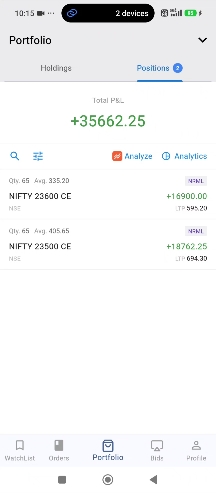
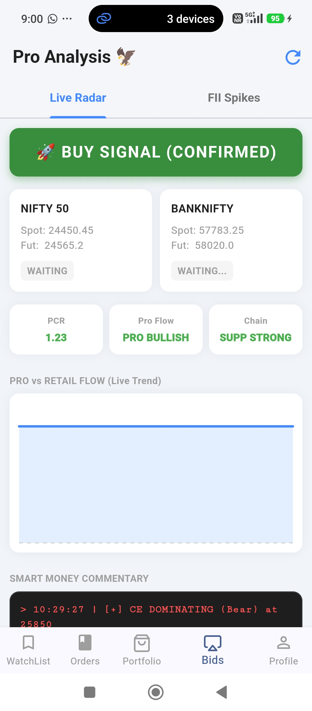
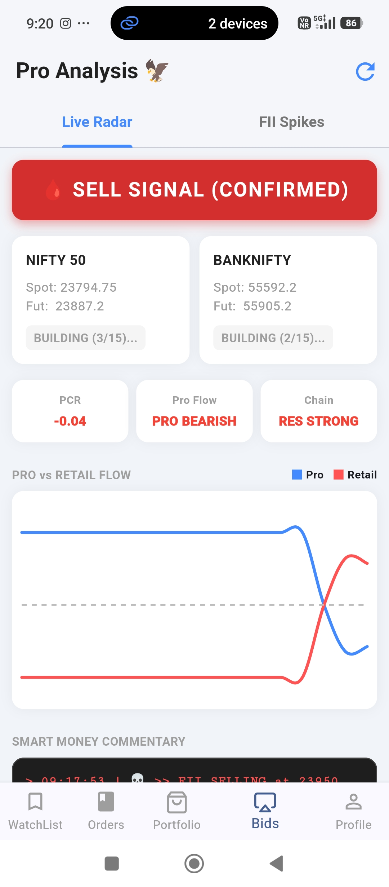
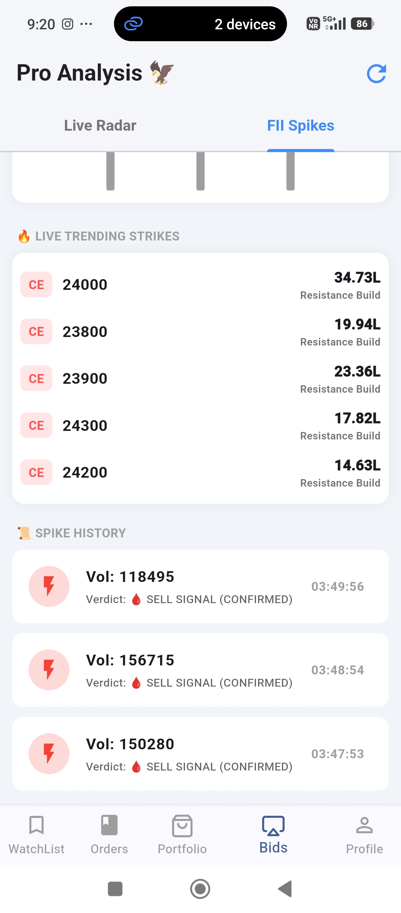
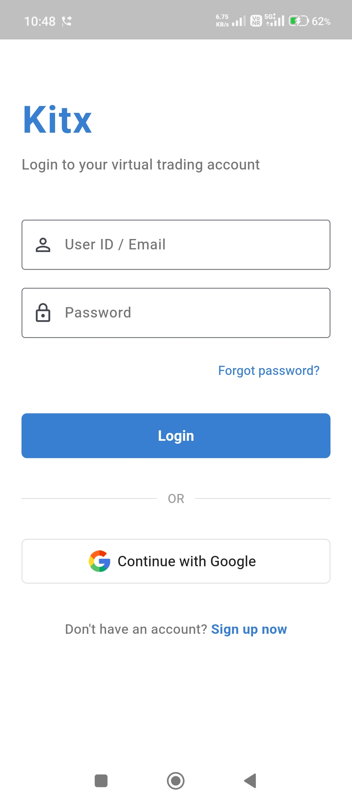
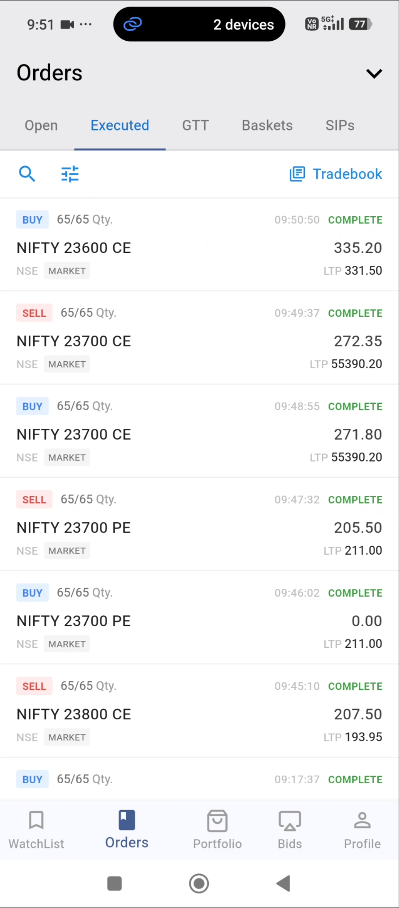
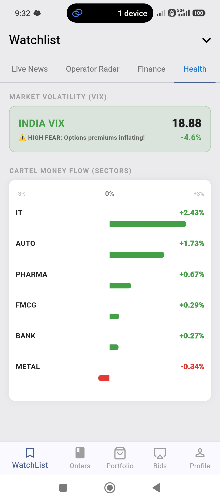

# 📈 Kitx - The Ultimate Paper Trading & Market Analysis App

Welcome to **Kitx**, the most advanced virtual trading platform designed specifically for the Indian Stock Market. Whether you are a beginner looking to practice without risking real capital, or an experienced trader forward-testing new setups, Kitx provides a seamless, premium, and ultra-realistic trading experience.

---

## 🚀 Why Choose Kitx? (Key Features)

* **📊 Live Market Data:** Get real-time stock quotes and pricing to take trades exactly like you would in a live market.
* **🎯 Sniper PRO Alerts (Smart Money Tracker):** Get ahead of the retail crowd! Our inbuilt engine monitors Put-Call Ratios (PCR) and institutional buying signals to send you automated alerts when a big move is expected.
* **💼 Realistic Portfolio Management:** Track your **Holdings** and **Positions** with dynamic, real-time Profit & Loss (P&L) calculations.
* **⚡ Advanced Order Execution:** Supports Intraday (MIS) and Long-term (CNC) trades with authentic 5x margin logic, Market/Limit orders, and instant 1-click square-offs.
* **📰 Live Market News:** Stay updated with live financial news aggregated from top sources right inside your trading dashboard.
* **🎨 Distraction-Free Pro UI:** A clean, intuitive interface built for serious traders, giving you a premium brokerage feel.

---

## 📸 App Screenshots
*(Check out the interface below)*

  
  
  
  
  
  
  

---

## 📥 How to Download & Start Trading

Want to test your trading psychology and setups risk-free? 
1. Go to the **Releases** section of this GitHub repository. 
2. Download the latest `Kitx_v1.0.apk` file.
3. Install it on your Android device (Grant 'Install from unknown sources' if prompted).
4. Add virtual funds to your wallet and start trading!

---

## 🤝 For YouTubers & Trading Communities

Looking for the best paper trading app to feature in your trading challenges or beginner guides? **Kitx** is completely free, ad-free, and packed with institutional-level data tracking (PCR & Smart Money alerts). Feel free to use this app in your content to show your audience how to practice trading the right way!

---

## ⚠️ Disclaimer
**Kitx** is a simulated/paper trading application built strictly for **educational and practice purposes**. The virtual funds hold no real-world monetary value. Always consult a certified financial advisor before investing real money in the stock market.
